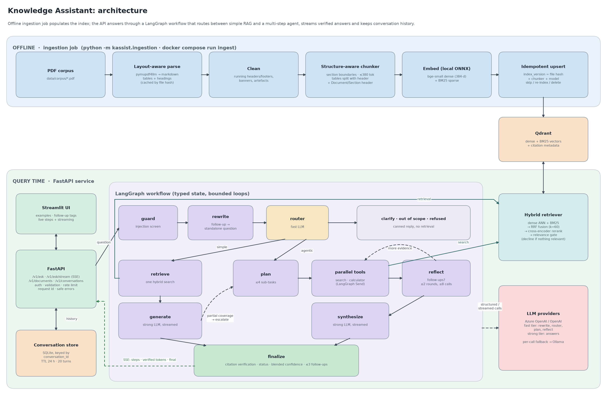
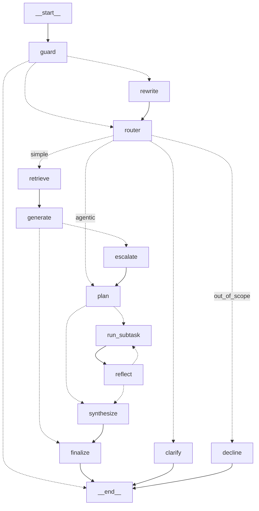

# Intelligent Knowledge Assistant

A production-oriented question-answering service over a collection of PDFs. It combines **hybrid
RAG** (dense + BM25, RRF fusion, cross-encoder reranking) with a **LangGraph agentic workflow**
(plan, parallel tool calls, reflect, synthesise) for multi-step, comparison and calculation questions.
A router decides which workflow a question needs. Every answer cites document and page, and questions
the corpus cannot answer are **declined, not guessed**.

| Requirement | Where |
|---|---|
| Ingestion pipeline (separate, incremental) | `src/kassist/ingestion/`, `python -m kassist.ingestion` |
| RAG with source attribution + no fabrication | `src/kassist/retrieval/`, `src/kassist/agent/citations.py` |
| Agentic workflow + routing | `src/kassist/agent/graph.py` |
| REST API with request/response contract | `src/kassist/api/` (OpenAPI at `/docs`) |
| Docker / compose / `.env.example` | `Dockerfile`, `docker-compose.yml`, `.env.example` |
| Evaluation set + approach + results | `configs/eval_questions.yaml`, `scripts/run_eval.py`, `docs/eval/` |
| Unit + API + E2E tests | `tests/` |
| Architecture diagram + design write-up | [below](#architecture), [`docs/design.md`](docs/design.md) |
| Demo UI | `src/kassist/ui/streamlit_app.py` (port 8501) |

---

## Quickstart

**Prerequisites**: Docker with Compose v2.24+ (for the Docker path), or Python 3.11+ (the Docker image uses 3.12;
developed and tested on 3.14). About 2 GB of disk for images and models. On Windows, run the shell scripts from
Git Bash.

```bash
cp .env.example .env          # then set the LLM (see "Configure the LLM" below)
docker compose up --build     # Qdrant -> ingestion job -> API :8000 -> UI :8501
```

**Configure the LLM** in `.env`, using one of these three:

```bash
# OpenAI (api.openai.com)
LLM__PROVIDER=openai
OPENAI_API_KEY=sk-...

# Azure OpenAI (used for the results in this README). Endpoint = resource root, deployment = the name
# you gave the deployment in Azure AI Foundry (not necessarily the model name)
LLM__PROVIDER=azure
AZURE_OPENAI_ENDPOINT=https://<resource>.openai.azure.com/
AZURE_OPENAI_API_KEY=...
LLM__AZURE_ROUTER_DEPLOYMENT=gpt-5-mini     # small/fast model: routing, planning, rewriting
LLM__AZURE_SYNTH_DEPLOYMENT=gpt-5.4         # strong model: answers

# Local only, no key: start with `docker compose --profile ollama up --build`
LLM__PROVIDER=ollama
```

Check what is active at http://localhost:8000/ready (`"llm": {"fast": "azure:gpt-5-mini -> ollama:…"}`).
Every other setting (retrieval, chunking, agent budgets, conversation TTL) is in `configs/default.yaml` and
can be overridden from the environment, e.g. `RETRIEVAL__TOP_K=8`.

* UI: http://localhost:8501 · API docs: http://localhost:8000/docs · Qdrant dashboard: http://localhost:6333/dashboard
* The first build downloads Python wheels and the three local ONNX models (~150 MB). They are baked into the image, so containers run offline afterwards.
* Ingestion runs as a one-shot container before the API starts. It is idempotent, so restarts skip unchanged documents.
* **No OpenAI key?** `docker compose --profile ollama up --build` adds a local Ollama server and pulls `qwen2.5:7b-instruct` (~4.7 GB). It also serves as the automatic fallback when OpenAI calls fail. Expect slower, lower-quality answers on CPU.

### Local development (without Docker)

One script wraps everything (bash; on Windows run it from Git Bash):

```bash
scripts/local.sh setup     # .venv + dependencies + local models + .env (then fill in the LLM settings)
scripts/local.sh test      # unit + API tests
scripts/local.sh up        # index the corpus, start API :8000 + UI :8501 (Ctrl+C stops both)
scripts/local.sh eval e2e  # evaluation (stop the API first); also: ingest, api, ui, e2e
```

Equivalent manual steps:

```bash
python -m venv .venv && .venv/bin/pip install -r requirements.txt && .venv/bin/pip install -e ".[dev]"
python -m kassist.ingestion                      # embedded Qdrant in ./.qdrant, models cached on first run
uvicorn kassist.api.main:app --port 8000
streamlit run src/kassist/ui/streamlit_app.py
pytest                                           # 153 tests, no network or API key needed
```

Behind a TLS-inspecting corporate proxy, the first model download may fail with `CERTIFICATE_VERIFY_FAILED`.
Run `scripts/download_models.py` once with the OS trust store (`pip install truststore`, then
`python -c "import truststore; truststore.inject_into_ssl(); import runpy; runpy.run_path('scripts/download_models.py', run_name='__main__')"`)
with `EMBEDDINGS__CACHE_DIR=models`, then set `HF_HUB_OFFLINE=1`.

---

### Testing the ingestion pipeline

Ingestion is a separate, idempotent job: it is not run per question, and it only re-processes what changed.

```bash
# 1. First run (automatic with `docker compose up`): per-document pages/chunks/tables, then ingest.done
docker compose logs ingest

# 2. Re-run with nothing changed: every document is skipped in ~0 s
docker compose run --rm ingest                  # log: ingest.skip_unchanged x3

# 3. Add a PDF (./data/corpus is mounted into the job, no rebuild needed)
cp my_new_doc.pdf data/corpus/ && docker compose run --rm ingest     # indexes only the new file
curl -s localhost:8000/v1/documents             # the running API lists it within ~15 s, no restart

# 4. Change or delete a PDF: only that document is re-indexed (new points written before old ones are
#    removed, so it never disappears mid-update) or removed from the index
rm data/corpus/my_new_doc.pdf && docker compose run --rm ingest       # log: ingest.removed

# 5. Force a full rebuild
docker compose run --rm ingest python -m kassist.ingestion --force
```

* Index contents: Qdrant dashboard at http://localhost:6333/dashboard (collection `knowledge_base`).
* Chunk quality: `python scripts/inspect_chunks.py` writes every chunk with its section and pages to
  `docs/chunk_samples.md`.
* Safety checks: if the index was built with a different embedding model or chunking settings than the
  API is configured for, `/ready` reports it and the API refuses to answer until ingestion is re-run.
* Automated tests: `pytest tests/unit/test_pipeline.py tests/unit/test_chunker.py tests/unit/test_cleaning.py`
  (skip / re-index / delete / one bad file doesn't stop the run / section boundaries / table splitting),
  plus `tests/integration/test_api.py::test_api_picks_up_reingestion_without_restart`.
* Locally without Docker: `scripts/local.sh ingest` (stop the API first; the embedded Qdrant file can be
  opened by one process at a time. The server Qdrant in Docker has no such limit).

---

## Problem understanding and assumptions

The goal is an assistant that answers questions over unstructured documents, **grounded** in those
documents, with **traceable sources**, and that handles three kinds of question differently:
direct factual ones (one retrieval is enough), multi-step ones (comparisons, multi-constraint
recommendations, cross-document synthesis, calculations), and ones the documents do not answer.

Reading the corpus shaped the design:

* **Much of the knowledge is in tables** (benchmarks, pricing, comparison matrices). Table-aware parsing
  is therefore the biggest single quality lever, so I used layout-aware extraction to markdown tables.
* **The corpus plants traps.** Its own text says questions about *Qdrant, Milvus, Haystack, Semantic Kernel
  and Flowise* should be declined. Qdrant is subtle: it appears in one RAG-doc table (scale/filtering/hybrid)
  but has no benchmarks, so "Qdrant p99 latency?" deserves a *partial* answer, not a refusal and not a guess.
* **The vector DB cover page quotes an evaluation question verbatim** ("cost-conscious startup needing hybrid
  search and ACID"). That chunk wins retrieval for the literal question but contains no answer, a real
  failure mode for single-shot RAG that the agentic decomposition fixes.

Assumptions (the brief invites safe assumptions):

1. The corpus is the **3 PDFs provided**. The documents call themselves "Document 3 of 6" / "6 of 6" and
   the brief mentions "6 topics", but only 3 were supplied. The system handles any number of PDFs in
   `data/corpus/`.
2. File names differ in case from the brief (`rag_architecture_patterns.pdf` vs `RAG_Architecture_Patterns.pdf`).
   Document ids are slugified file names; display titles are read from each cover page.
3. English-only, single-tenant, read-only knowledge base, with answers in English.
4. "Insufficient information" means *not stated in the documents*. The assistant does not fill gaps from
   the LLM's general knowledge, even when it could.
5. Page numbers are 1-based PDF pages (they match the printed page numbers in this corpus).

---

## Architecture



Also as [SVG](docs/architecture.svg). Rendered from code with `python scripts/render_architecture.py`, so it is
versioned with the implementation.

The LangGraph state graph (generated from the code with `graph.get_graph().draw_mermaid()`):



Full component, request-lifecycle, scalability, latency, cost, security and monitoring discussion:
**[docs/design.md](docs/design.md)**.

### How it works

**Ingestion** (`python -m kassist.ingestion`)
1. `pymupdf4llm` turns each page into markdown with real tables and font-size-based headings. The raw
   parse (~3 s/page on CPU) is cached by file hash.
2. A cleaner removes running headers/footers, letter-spaced banners and bullet artefacts.
3. The chunker packs blocks into chunks of ≤380 estimated tokens along section boundaries:
   * a sibling heading always starts a new chunk, while small sub-sections (e.g. "STRENGTHS") stay with their parent;
   * oversized tables are split by rows with the header repeated, and long prose is split by sentence with overlap;
   * each chunk is embedded with a `Document / Section` header.
   The result is 105 chunks for this corpus.
4. Dense (bge-small, 384-d) and BM25 sparse vectors are upserted to Qdrant with full citation metadata
   (doc, title, file, page range, section, chunk id) and an `index_version` (file hash + chunker version +
   embedding model). Unchanged files are skipped. Changed files are re-indexed new-before-delete, and removed files are deleted.

**Retrieval**: dense and BM25 run in parallel (30 each), are fused with RRF (k=60) in Qdrant, and the top
20 are reranked by a cross-encoder whose sigmoid score is a calibrated relevance in [0, 1]. The best score
drives the **relevance gate**: below `min_relevance` the system declines *without calling the answer model*.

**Routing and agentic workflow** (LangGraph):
* the guard blocks direct injection attempts;
* the router (fast model, structured output, aware of the document catalogue) picks `simple`, `agentic`, `clarify` or `out_of_scope`;
* **simple**: one retrieval and a grounded answer. If the model reports only *partial* coverage, the request **escalates once** to the agentic path;
* **agentic**: the planner emits ≤4 typed sub-tasks (`search` with an optional document filter, or `calculator`), which run **in parallel**. `reflect` can add ≤2 follow-ups, such as a calculation over numbers found in the evidence. It is hard-capped at 2 iterations and 8 tool calls, and the strong model then synthesises.

**Follow-up questions (conversation history)**: the server keeps each conversation in a SQLite store keyed
by an opaque `conversation_id` (returned by `/v1/ask`, sent back by the client). When a question arrives
with history, a **rewrite** step (fast model) turns follow-ups into standalone questions before routing:
"What recall does *it* reach?" after a pgvector answer becomes "What recall@10 does pgvector achieve…?".
Standalone questions and topic changes pass through unchanged. Routing, retrieval and grounding then work
on the standalone question, so answers still come only from the documents. Only question, answer and
status are stored, with a 24 h idle TTL and a 20-turn cap, and `DELETE /v1/conversations/{id}` erases a
conversation.

**Streaming (`POST /v1/ask/stream`, Server-Sent Events)**: workflow steps stream as they happen
("chose a workflow", "searched …", "writing answer"), then the answer streams token by token. The answer
model writes a small plain-text protocol (`COVERAGE` / `CONFIDENCE` / `ANSWER` / `FOLLOW_UPS`) so the
grounding checks can run *inside* the stream:
* coverage arrives before any answer text, so a "not covered" answer is never streamed, and a simple-RAG
  answer that will be escalated is abandoned (generation stops) before anything is shown;
* each `[n]` marker is validated the moment it is complete; markers pointing at passages the model was not
  given are dropped and valid ones renumbered by first use, so streamed citation numbers never change;
* text is held back until the first valid citation, so an answer that never cites anything is never shown;
* the final `final` event carries the verified answer, which replaces the streamed text.
`/v1/ask` uses the same generation path and returns the same result in one piece.

**Confidence and suggested follow-ups**: answered/partial responses carry a **blended confidence score**:
evidence relevance of the cited passages (35%), coverage (25%), share of citation markers that were valid
(15%) and the model's self-rating (25%). The model's own rating alone is poorly calibrated: on a
question the documents did not cover, `gpt-5.4` reported 0.99. The same model call also proposes three
follow-up questions (sanitised, deduplicated, injection-checked). They are **suppressed when confidence is
below 0.4**, so a weak answer doesn't steer the user further. In the UI they are clickable and are asked as
the next turn of the conversation.

**Grounding**: the answer model must cite passage ids and self-report coverage (`full | partial | none`).
The verifier drops citations to passages that were not provided and renumbers the rest. A "full" answer with
no valid citation is rejected as ungrounded.

---

## API

`POST /v1/ask`

```json
{
  "question": "Which vector database suits a cost-conscious startup that needs hybrid search and ACID?",
  "mode": "auto",                 // auto | rag (force simple) | agent (force agentic)
  "top_k": 6,                     // optional, 1-20
  "doc_ids": null,                // optional filter, e.g. ["vector_database_comparison"]
  "include_trace": true,
  "conversation_id": null         // omit/null = new conversation; send the returned id for follow-ups
}
```

Response (abridged; values illustrative):

```json
{
  "request_id": "6c0e...",
  "conversation_id": "3f2b9c1e-...",   // send back with the next question to ask follow-ups
  "status": "answered",           // answered | partial | insufficient_context | clarification_needed | out_of_scope | refused
  "answer": "pgvector is the only option with full ACID compliance [1] ... partial hybrid search via tsvector [1] ...",
  "citations": [
    {"id": 1, "document": "Vector Database Comparison", "doc_id": "vector_database_comparison",
     "source_file": "vector_database_comparison.pdf", "pages": "p. 4", "page_start": 4, "page_end": 4,
     "section": "Vector Database Comparison > Head-to-Head Comparison Matrix",
     "chunk_id": "a1b2...", "snippet": "|Dimension|FAISS|Pinecone|...", "relevance": 0.97}
  ],
  "workflow": {
    "route": "agentic", "reason": "multi-constraint selection across databases", "escalated": false,
    "rewritten_question": null,   // set when a follow-up was rewritten using the conversation
    "iterations": 1, "tool_calls": 3, "llm_calls": 4,
    "queries": ["pgvector ACID compliance", "vector databases with native hybrid search", "low-cost vector database for startups"],
    "steps": [{"node": "router", "detail": "agentic: ...", "ms": 812.4}, "..."]
  },
  "usage": {"input_tokens": 9123, "output_tokens": 611, "by_model": {"gpt-5-mini": {}, "gpt-5.4": {}}},
  "latency_ms": 7421.3,
  "confidence": {"score": 0.87, "level": "high",
                 "components": {"evidence": 0.94, "coverage": 1.0, "citations": 1.0, "model": 0.9}},
  "follow_ups": ["What latency does pgvector HNSW have at 1M vectors?", "..."],
  "warnings": []
}
```

`POST /v1/ask/stream` takes the same body and returns Server-Sent Events: `step` → `status` → `token`… →
`final` (the response above) or `error`. Other endpoints: `GET /v1/conversations/{id}` (a conversation's turns), `DELETE /v1/conversations/{id}`
(erase it), `GET /v1/documents` (indexed documents), `GET /health` (liveness), `GET /ready`
(index present and built with the configured embedding model, models warm). Errors always use
`{"error": {"code", "message", "request_id"}}`: `invalid_request` 422, `unauthorized` 401,
`not_found` 404 (unknown or expired conversation), `rate_limited` 429, `not_ready`/`llm_unavailable` 503, `internal_error` 500 (no internals leaked).

```bash
curl -s localhost:8000/v1/ask -H 'content-type: application/json' \
     -d '{"question": "What recall@10 does pgvector HNSW achieve at 1M vectors?"}' | jq
```

Follow-up question in the same conversation (the server resolves "it" from the stored history):

```bash
CID=$(curl -s localhost:8000/v1/ask -H 'content-type: application/json' \
      -d '{"question": "Which vector database offers full ACID compliance?"}' | jq -r .conversation_id)
curl -s localhost:8000/v1/ask -H 'content-type: application/json' \
     -d "{\"question\": \"What recall@10 does it achieve at 1M vectors?\", \"conversation_id\": \"$CID\"}" \
  | jq '{answer, rewritten: .workflow.rewritten_question}'
```

Streaming (`-N` disables curl's buffering):

```bash
curl -N localhost:8000/v1/ask/stream -H 'content-type: application/json' \
     -d '{"question": "Compare Pinecone and Weaviate for hybrid search"}'
# event: step    data: {"node": "router", "detail": "agentic: ...", "ms": 812.4}
# event: status  data: {"detail": "writing answer"}
# event: token   data: {"text": "Weaviate offers native hybrid search [1] ..."}
# event: final   data: { ...the full /v1/ask response... }
```

If `API_KEY` is set, add `-H "X-API-Key: $API_KEY"`. Interactive documentation for every endpoint and
field: http://localhost:8000/docs.

---

## Design decisions (summary)

| Area | Decision | Why |
|---|---|---|
| Parsing | pymupdf4llm (layout model) | Tables hold most facts; plain text extraction destroyed them. |
| Chunking | Section-aware, ≤380 tokens, table row-splitting with header, contextual header | One topic per chunk, self-describing table pieces, stays inside bge-small's 512-token window. |
| Embeddings | Local bge-small (ONNX via fastembed) + BM25 | No key for ingestion, no PyTorch, deterministic. BM25 catches exact identifiers (`IndexIVFPQ`, `ef_construction`). |
| Ranking | RRF + MiniLM cross-encoder | Score-free fusion, and a calibrated relevance used both for ordering and for the decline gate. |
| Vector store | Qdrant | Native dense+sparse hybrid with server-side fusion, payload filters, and the same code in embedded (tests/dev) and server (compose) mode. pgvector would win if ACID or an existing Postgres mattered. |
| Orchestration | LangGraph, plan-and-execute + bounded reflection | Explicit, testable routing, parallel fan-out, hard cost bounds, checkpointing available. ReAct's cost is unbounded; CrewAI/AutoGen solve different problems. |
| LLM | Azure OpenAI `gpt-5-mini` (routing, planning, rewrite) + `gpt-5.4` (answers); OpenAI direct or Ollama via config; per-call Ollama fallback | Cheap model for control decisions, strong model only where answer quality is visible. Hosted models gave the reliable structured output, cite-or-decline behaviour and streaming the design needs; a local 7B model is the fallback, not the default. |
| Anti-hallucination | Relevance gate + coverage self-report + citation verification | A prompt alone is not a control; each layer is tested. |
| Conversation history | Server-side store keyed by `conversation_id` + a rewrite step for follow-ups | History can't be forged by the client, works for any API client; the rest of the pipeline sees self-contained questions. |
| Streaming | SSE with steps + verified answer tokens (coverage-first text protocol) | Progress on 10–30 s agentic questions without ever showing an unverified citation or a withdrawn answer. |
| Confidence | Blend of evidence relevance, coverage, citation validity and model self-rating | Model self-ratings alone are poorly calibrated (0.99 on an uncovered question in testing). |

Details and alternatives: [docs/design.md](docs/design.md#3-key-decisions-and-alternatives).

---

## Evaluation

**Eval set**: [`configs/eval_questions.yaml`](configs/eval_questions.yaml), 19 hand-labelled questions:
6 simple, 4 multi-step, 1 tool-use, 1 follow-up (with conversation history), 2 ambiguous, 2 unanswerable (the corpus's planted Milvus /
Semantic Kernel cases), 1 partially answerable (Qdrant latency), 1 out-of-scope, 1 prompt injection.
Each has gold `(document, page)` sources, required key facts (with accepted spellings), the acceptable
route(s) and status(es), and a `should_decline` flag.

**How each dimension is measured** (`scripts/run_eval.py`):

| Dimension | Metric | Method |
|---|---|---|
| Retrieval quality | Hit@1/3/k, Recall@k, MRR | Gold labelled at (document, page) level, so labels survive re-chunking. Ablation: dense, BM25, hybrid, hybrid + rerank variants. |
| Decline gate | Answerable-pass rate, unanswerable-block rate, score distribution | Calibrates `min_relevance`. |
| Answer correctness | Key-fact coverage | Deterministic normalised match against required facts. |
| Grounding | Faithfulness (claim level) + gold-source citation rate | LLM judge splits the answer into claims and checks each against the cited passages (RAGAS-style). Plus whether a citation points at a gold page. |
| No fabrication | Decline recall, false-decline rate | Unanswerable / out-of-scope / adversarial must be declined; answerable ones must not be. |
| Agent behaviour | Route accuracy, status accuracy, tool calls, iterations, escalations | Compared with expected routes/statuses; budgets are asserted in unit tests. |
| Cost / latency | Tokens per question, p50/p95 per route | From the response `usage` and timings. |

```bash
python scripts/run_eval.py retrieval      # no LLM needed
python scripts/run_eval.py e2e            # full system + LLM judge (needs OpenAI, Azure OpenAI or Ollama configured)
```

### Results

**Retrieval** (13 answerable questions, k = 6; full report in [`docs/eval/retrieval.md`](docs/eval/retrieval.md)):

| Variant | Hit@1 | Hit@3 | Hit@6 | Recall@6 | MRR | Latency / query* |
|---|---|---|---|---|---|---|
| Dense only (bge-small) | 0.69 | 0.92 | 1.00 | 0.87 | 0.83 | |
| BM25 only | 0.54 | 1.00 | 1.00 | 0.94 | 0.74 | |
| Hybrid (RRF) | 0.69 | 0.92 | 1.00 | 0.95 | 0.82 | 38 ms |
| Hybrid + rerank, full passages | **0.77** | 0.92 | 1.00 | 0.95 | **0.85** | 11.2 s |
| **Hybrid + rerank, first 700 chars (default)** | **0.77** | 0.92 | 1.00 | 0.87 | **0.85** | 1.9 s |

\* Mean on a low-power laptop CPU (Intel Core 5 120U, on battery), from [`docs/eval/retrieval_latency.md`](docs/eval/retrieval_latency.md). The cross-encoder dominates.

* Dense and BM25 fail on *different* questions (BM25 has the best Hit@3 and the worst Hit@1). Hybrid gives the best recall, and the reranker fixes the ordering (MRR 0.82 → 0.85, Hit@1 0.69 → 0.77).
* Truncating passages to 700 characters before reranking keeps Hit@1, MRR and gate accuracy identical at **one sixth** of the latency, so it is the default. Set it to `null` on a GPU or a fast CPU.
* **Relevance gate**: best rerank score is ≤ 0.003 for every question that must be declined and ≥ 0.68 for every answerable one, so the 0.10 threshold blocks 100% of unanswerable/out-of-scope questions and passes 100% of answerable ones, with a wide margin.

**End-to-end** (19 questions, Azure OpenAI `gpt-5-mini` + `gpt-5.4`, LLM judge for faithfulness; full report
with every answer in [`docs/eval/e2e.md`](docs/eval/e2e.md)):

| Metric | Result |
|---|---|
| Route accuracy | 95% (18/19) |
| Status accuracy (answered / partial / declined / clarify / refused as expected) | 100% |
| Decline recall: unanswerable, out-of-scope and injection questions declined | 100% (4/4) |
| False-decline rate: answerable questions refused | 0% |
| Key-fact coverage | 100% |
| Answers citing a gold (document, page) source | 100% |
| Faithfulness (claim-level LLM judge) | 0.98 |
| Mean confidence: fully covered answers vs partial answers | 0.94 vs 0.78 |
| Mean tokens per question | ~3,700 |
| Latency p50 / p95: simple route · agentic route | 10.0 / 19.7 s · 32.6 / 33.1 s |

Reading the results:
* **No hallucinated answers**: all four questions that had to be declined were declined (Milvus, Semantic
  Kernel, weather, prompt injection), and no answerable question was refused.
* **Multi-step questions M1–M3 came back `partial`, correctly.** For example, no database in the corpus is
  simultaneously cheap, hybrid-search-capable and ACID; the answer says so, explains the trade-off
  (pgvector is the only ACID option but only partially hybrid) and cites the comparison matrix and selection
  guide. Confidence drops accordingly, so the score tracks answer completeness.
* **Follow-up resolution worked** (F1): "What recall@10 does *it* achieve…?" was rewritten to pgvector from the
  conversation and answered with the gold table row.
* **Latency** was measured on a low-power laptop CPU with GPT-5-family reasoning models; the cross-encoder
  (~2 s) and the reasoning models' time to first token dominate. Agentic questions make 4–6 LLM calls, which
  is why streaming the steps and the answer matters for perceived latency.

### Failure modes found and how they were addressed

| # | Failure mode (how it was found) | Type | Fix |
|---|---|---|---|
| 1 | Benchmark/pricing tables came out as unreadable column soup with plain text extraction, and PyMuPDF's `find_tables` treated whole styled pages as one table (manual inspection of extracted pages) | ingestion | Layout-aware `pymupdf4llm` markdown tables. |
| 2 | FAISS and Chroma content was filed under the previous section ("KEY INSIGHT", "LIMITATIONS"): a tiny box below the minimum size suppressed the split at the next heading (manual inspection of `docs/chunk_samples.md`) | chunking | Sibling/parent headings always close a chunk; only true sub-sections fold into the parent. Chunker v1.1 re-indexed automatically via `index_version`. |
| 3 | The vector DB cover page quotes eval question M1 verbatim and gets the top rerank score (0.999) while containing no answer (retrieval eval, per-question ranks) | retrieval | Router sends multi-constraint questions to the agentic path; decomposed searches reach the comparison matrix and selection guide. Simple RAG also escalates when the answer model reports partial coverage. |
| 4 | "Qdrant p99 latency" retrieves highly relevant benchmark tables (0.95) that simply do not list Qdrant, so the relevance gate cannot catch it (gate calibration table) | generation | Caught downstream: the answer model must self-report `partial`/`none` coverage and cite. This is the hardest case and is in the eval set (P1). |
| 5 | Cross-encoder took 11 s/query on a laptop CPU (latency profiling) | latency | Passage truncation (6× faster, same quality); warm-up at startup removed a 16 s first-query penalty. |
| 6 | First model download failed behind a TLS-inspecting proxy, and fastembed's BM25 never resolved from cache offline (it declares files that don't exist upstream) | ops | `scripts/download_models.py` bakes models into the image and completes the BM25 cache, so containers run with `HF_HUB_OFFLINE=1`. |
| 7 | 500 responses lacked `X-Request-ID` because Starlette's outer error middleware bypassed the request middleware (API test) | API | Errors are handled inside the request middleware. |
| 8 | **T1, the storage calculation, was routed as *simple*** instead of agentic (the only routing miss). The answer was still correct (~120 GB float32, ~30 GB int8) because the strong model scaled the corpus's "~12 GB per 1M vectors" row itself, but that is in-model arithmetic rather than the deterministic calculator tool, and approximate (exact: 122.9 GB). | routing | Open: add calculation cues ("how much storage", "calculate", numbers with units) to the router prompt or as a pre-router rule, then re-run the eval. |
| 9 | **F1 faithfulness 0.8**: one sentence attached "at 1M" to pgvector's general recall ranges, where the source uses "/1M" for *latency* (`85–95% recall, 10–50 ms/1M`). The judge flagged it as unsupported. | generation | Open: a claim-level verification pass (or prompt rule against merging qualifiers from different columns) would catch it; the headline number in the same answer was correct and cited. |
| 10 | **P1 (Qdrant) was declined rather than answered partially**: retrieval did not surface the single RAG-doc table row describing Qdrant (scale / filters / hybrid), so the model correctly said latency isn't covered but missed the partial information. No hallucination. | retrieval | Open: query expansion for entity questions (search the entity name alone as an extra sub-query) would likely surface it. |

---

## Testing

```bash
pytest                    # 153 unit / API / UI tests: fake models, in-memory Qdrant, no network or keys (~15 s)
pytest --cov=kassist      # line coverage: 85%
pytest -m e2e             # 6 end-to-end tests against a running stack with a real LLM
```

| Suite | Tests | Result |
|---|---|---|
| Unit + API + UI (`tests/unit`, `tests/integration`) | 153 | all passing; also run in CI on every push (`.github/workflows/ci.yml`) |
| End-to-end, live API + Azure OpenAI `gpt-5-mini` / `gpt-5.4` (`tests/e2e`) | 6 | all passing; run log in [`docs/eval/e2e_tests.txt`](docs/eval/e2e_tests.txt) |
| Answer-quality evaluation (19 questions) | | see [Evaluation](#evaluation) |

Coverage is 85% overall. Not counted: the Streamlit UI (its tests run through Streamlit's headless
`AppTest`, which executes the app outside the coverage tracer), the CLI entry points, the thin ONNX model
wrappers and the eval judge, all exercised by the end-to-end run and the evaluation instead.

* **Unit tests**: cleaning, chunking (section boundaries, table splitting, overlap, determinism), safe
  calculator (rejects `__import__`, `9**9**9`), injection guard (including no false positives on legitimate
  "prompt injection" questions), citation verification, retrieval ranking/gating/filters, embedding-model
  mismatch detection, incremental ingestion (skip / re-index / delete / one bad file), eval metrics.
* **Workflow tests** with a scripted LLM assert node sequences: simple path, decline without an LLM call,
  partial-coverage escalation, calculator follow-up, reflection budget, router and planner LLM outage fallbacks,
  hallucinated-citation rejection, clarify / out-of-scope / refused paths, prompt fencing, follow-up rewriting
  (rewrite before routing, no rewrite without history, LLM-failure fallback, history cap, injected rewrites rejected).
* **API tests** through the full HTTP stack: contract, trace toggle, validation envelope (values not echoed),
  API-key auth, LLM outage → 503, internal errors not leaked, not-ready behaviour, conversation flow
  (follow-up rewritten from stored history, read/delete endpoints, malformed or unknown ids, refused turns not stored).
* **Conversation store**: ordering, turn cap, persistence across instances, isolation, TTL expiry, deletion.
* **Streaming and answer safety**: the incremental answer parser at every chunk size (citation markers split
  across chunks, invalid ones dropped, renumbering, first-citation gate, follow-ups never streamed as answer
  text, malformed output), escalated answers never streamed, declines never streamed, low confidence
  suppresses follow-ups, `stream()` and `run()` return identical results, SSE contract and error events.
* **LLM client**: provider selection (OpenAI / Azure deployments / Ollama), fail-fast Azure config, reasoning
  models get no temperature, fallback only before the first streamed token, mid-stream failure raises.
* **UI** (headless `AppTest`, mocked API): layout and sidebar, streamed answer with sources, confidence and
  follow-ups, follow-up click continues the conversation, example tags, clear conversation erases it
  server-side, error events shown.
* **E2E** (`tests/e2e`, live API + real LLM): corpus indexed, a simple question answered with the right page
  cited, the agentic route used for a multi-constraint question, Milvus declined, injection refused, and the
  stream delivering verified tokens, confidence and follow-ups.

---

## Security and responsible AI

| Area | What is in place | Verified by |
|---|---|---|
| **No secrets committed** | Secrets only come from the environment / `.env` (gitignored, along with the conversation database, local index and model cache). `.env.example` has empty values. Keys are held as `SecretStr` and redacted from logs. No secrets in the Docker image. | Repository scan before publishing; `.gitignore` |
| **Input validation and sanitisation** | Strict Pydantic request models (`extra="forbid"`, length limits, `top_k` 1–20, enum modes, known `doc_ids` only, conversation ids must be UUIDs). Questions are Unicode-normalised with control characters stripped. Model-suggested follow-ups are sanitised and injection-checked before display. Source snippets are escaped before rendering. | API, guard and UI tests |
| **Error message safety** | One error envelope `{code, message, request_id}`. Stack traces and exception text never reach clients (also on the SSE stream), and validation errors don't echo submitted values. Details go to server logs under the request id. | API tests inject internal errors containing fake secrets and assert they don't leak |
| **Data privacy** | Question text is not logged by default (fingerprint and length only). Conversations store only question, answer and status, expire after 24 h idle, are capped at 20 turns, and can be erased with `DELETE /v1/conversations/{id}`. Embeddings and reranking run locally; only the question and retrieved passages go to the LLM provider. With `LLM__PROVIDER=ollama`, nothing leaves the host. | Design §7; conversation store tests |
| **Prompt-injection awareness** | Direct injection: a narrow pattern guard blocks override / prompt-exfiltration attempts before any LLM call (eval question X1 refused), and blocked turns are never stored as conversation context. Indirect injection (via documents or history): the question, conversation and retrieved passages are fenced and declared untrusted in every prompt. Tools are read-only (search, AST-whitelisted calculator, no code execution, network or writes). A rewritten follow-up is re-checked by the guard. | Guard tests (incl. no false positives on legitimate "prompt injection" questions), workflow tests, e2e injection test |

Not covered: there is no automatic PII detection or redaction in stored conversations or in what is sent to
the LLM, and the injection guard is pattern-based (paraphrased or multilingual attacks rely on the other
layers). Both are listed under production improvements. Full table: [docs/design.md §7](docs/design.md#7-security-and-responsible-ai).

---

## Limitations

* The eval set is small (19 questions), so the metrics are indicative, not statistically tight. The LLM judge
  shares a model family with the generator.
* Cross-encoder reranking is CPU-bound. On a low-power laptop CPU it dominates retrieval latency (see the table above).
* The injection guard is pattern-based. It catches direct overrides, not paraphrased or multilingual attacks
  (other layers limit the impact).
* Conversation history is stored in SQLite, which suits a single API instance. Several replicas need shared
  storage: implement the same `ConversationStore` interface on Redis or Postgres.
* The planner decides all first-round searches up front, so a bad plan costs one reflection round.
* `pymupdf4llm` occasionally duplicates text in styled "pros/cons" boxes. Harmless for retrieval, but visible in snippets.
* The chunk-size token budget is estimated (words × 1.3), not measured with the model tokenizer.
* Ingestion reads PDFs only (no DOCX/HTML/Markdown loaders) from a local folder (no S3/SharePoint
  connectors), and the header/footer cleaning rules are tuned to this corpus; other document sets would
  benefit from generic repeated-line detection.
* Open findings from the evaluation (calculation routing, one qualifier mix-up, one retrieval recall gap) are
  listed in [Failure modes](#failure-modes-found-and-how-they-were-addressed).
* PyMuPDF / pymupdf4llm are AGPL-licensed. Fine for this assessment; a commercial deployment would need a
  licence or a different parser.

## Production improvements

1. **Evaluation**: a larger eval set (synthetic generation + human review) run in CI as a regression gate;
   sampled online faithfulness scoring of live answers; thumbs up/down in the UI.
2. **Quality fixes from the eval**: calculation cues in the router, entity-name query expansion, a
   claim-level verification pass.
3. **Security**: OIDC instead of a static API key, per-user conversation ownership, tenant/document ACL
   metadata filters, model-based injection/PII classifiers in place of the pattern guard.
4. **Scale**: conversation store on Redis/Postgres for multiple replicas; GPU or hosted reranker; Qdrant
   quantisation and replication; ingestion as an event-driven worker; more loaders (DOCX, HTML, S3).
5. **Latency and cost**: response/semantic caching for repeated questions; skip the router call when
   heuristics are confident.
6. **Operations**: tracing with OpenTelemetry/LangSmith/Langfuse, dashboards for route mix, decline rate,
   fallback rate, confidence and cost.

---

## Repository layout

```
src/kassist/
  config.py            typed settings (env > .env > configs/default.yaml > defaults)
  observability.py     structlog JSON logging, redaction, fingerprints
  domain.py            Chunk / RetrievedChunk / DocumentInfo
  ingestion/           loader (pymupdf4llm + parse cache), cleaning, chunker, pipeline, CLI
  embeddings/          protocols + fastembed dense / BM25 / cross-encoder
  vectorstore/         Qdrant store (hybrid search, idempotent upserts, compatibility checks)
  retrieval/           hybrid retrieve -> rerank -> relevance gate
  llm/                 tiered client (OpenAI / Azure / Ollama, streaming, fallback), schemas, prompts
  agent/               LangGraph graph + state, guard, calculator, citation verifier,
                       answer_stream (safe streaming parser), confidence
  evaluation/          metrics + LLM judge
  api/                 FastAPI app factory, routes (incl. SSE streaming), schemas
  ui/                  Streamlit demo client
  conversations.py     server-side conversation history (SQLite store, TTL, turn cap)
  services.py          composition root (+ index refresh after re-ingestion)
configs/               default.yaml, eval_questions.yaml
scripts/               local.sh (setup/test/run), run_eval.py, download_models.py,
                       inspect_chunks.py, render_architecture.py
tests/                 unit/, integration/ (API + UI), e2e/ (live stack)
docs/                  design.md, architecture.png/.svg, eval/ (reports + e2e test log), chunk_samples.md
Dockerfile, docker-compose.yml, .env.example, requirements.txt, pyproject.toml, .github/workflows/ci.yml
```
