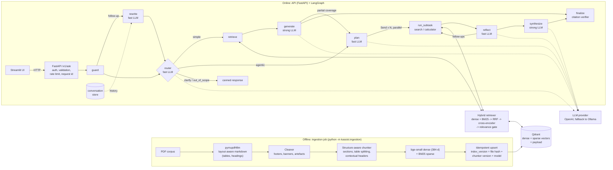

# System design

This document expands on the README's design-decision summary: the components, how a request
flows, and the scalability, latency, cost, security and operations trade-offs.

## 1. Components and data flow

Detailed view of the same flow:

The two pipelines share only the vector store and the embedding-model contract (enforced at API
startup). Ingestion can run on a schedule or be triggered by events, and it scales separately from the API.

## 2. Request lifecycle (`POST /v1/ask`)

1. **Middleware** assigns/propagates `X-Request-ID`, binds it to every log line, times the request.
2. **Validation** (Pydantic, `extra="forbid"`): length limits, `top_k` 1-20, known `doc_ids`, mode enum.
   API key (`X-API-Key`, constant-time compare) and per-IP rate limit when configured.
3. **guard**: Unicode normalisation, control-char stripping, narrow prompt-injection patterns. Blocked
   requests never reach an LLM (`status=refused`).
4. **rewrite** (only when the request continues a conversation): the API loads the last 4 turns from the
   conversation store, and the fast model rewrites a follow-up into a standalone question ("What recall does
   it reach?" becomes "What recall@10 does pgvector achieve…?"). Standalone questions pass through unchanged.
   The rewrite is re-checked by the injection guard, and an LLM failure keeps the question as asked.
5. **router** (fast model, structured output) picks `simple | agentic | clarify | out_of_scope`. The
   prompt contains a catalogue of documents and topics, so "Milvus" (in domain, not covered) is routed
   to retrieval and declined on evidence, while "weather" is declined as out of scope. If the LLM is
   down, regex heuristics take over.
6. **simple path**: one hybrid retrieval, then the relevance gate (no LLM call if nothing relevant),
   then a grounded answer with self-reported coverage. `partial`/`none` coverage with relevant evidence
   **escalates once** to the agentic path (adaptive RAG).
7. **agentic path**: the planner emits ≤4 typed sub-tasks, which LangGraph `Send` runs **in parallel**.
   `reflect` can add ≤2 follow-ups (new searches or a calculation over retrieved numbers). It is hard-capped
   at 2 iterations and 8 tool calls. Evidence is merged by chunk id and synthesised by the strong model.
8. **Answer generation (streamed)**: the answer model writes `COVERAGE` / `CONFIDENCE` / `ANSWER` /
   `FOLLOW_UPS`. An incremental parser validates and renumbers citation markers as they complete,
   holds text until the first valid citation, never streams a `none`-coverage answer, and stops a simple-RAG
   generation as soon as it reports less than full coverage (that answer is escalated, never shown).
   Verified text is emitted as `token` events through LangGraph's custom stream; `/v1/ask` uses the same path.
9. **finalize**: citation markers are checked against the exact passage list shown to the model.
   Invalid ids are removed and the rest renumbered. A "full" answer with no valid citation is rejected as
   ungrounded.
10. **Confidence and follow-ups**: a blended confidence (cited-evidence relevance, coverage, citation
   validity, model self-rating) is attached to answered/partial responses. Up to 3 sanitised follow-up
   questions are attached unless confidence is below 0.4.
11. The response carries the answer, citations (document, pages, section, snippet, relevance), the
   workflow (route, reason, escalation, executed queries, per-step timings), token usage and warnings.

## 3. Key decisions and alternatives

| Decision | Choice | Alternatives considered | Why |
|---|---|---|---|
| PDF parsing | pymupdf4llm (layout model) | PyMuPDF text, Unstructured, pdfplumber | Most facts in this corpus live in tables. Plain text extraction flattened them; pymupdf4llm returns markdown tables plus headings. It costs ~3 s/page on CPU, so the raw parse is cached by file hash. |
| Chunking | Structure-aware, ≤380 est. tokens, sentence overlap within sections, table row-splitting with repeated header, contextual header | Fixed 512/64 recursive split; semantic chunking | Section boundaries keep one topic per chunk. Header-repeated table pieces stay self-describing. The budget stays under bge-small's 512-token window, so the contextual header is never truncated. |
| Dense embeddings | BAAI/bge-small-en-v1.5 via fastembed (ONNX) | OpenAI text-embedding-3-small, bge-large | Local, free, deterministic, no PyTorch, and ingestion works without an API key. Quality is adequate for ~100 chunks. The `DenseEmbedder` protocol makes a swap one class. |
| Sparse | BM25 (fastembed `Qdrant/bm25`, IDF server-side) | SPLADE | Exact-match terms (`IndexIVFPQ`, `ef_construction`, model names) are common in this corpus. Server-side IDF keeps ingestion incremental. |
| Fusion + rerank | Qdrant RRF (k=60) + ms-marco-MiniLM-L-6 cross-encoder | Linear fusion, no rerank, Cohere rerank | RRF needs no score calibration. The cross-encoder fixes ordering and gives a **calibrated relevance score** that also drives the "no evidence, so decline" gate. |
| Vector store | Qdrant (server in compose, embedded mode for dev/tests) | pgvector, Chroma, FAISS | Native dense + sparse hybrid with server-side fusion, payload filters for per-document agent searches, persistence, and the same client code for embedded and server modes. pgvector would be the pick when ACID or an existing Postgres matters. Chroma lacks hybrid search; FAISS lacks persistence and filters. |
| Orchestration | LangGraph, plan-and-execute + bounded reflection | ReAct agent, CrewAI, AutoGen, custom loop | Routing is explicit, testable code with typed state, parallel fan-out (`Send`), cycles with hard budgets, and checkpointing available. CrewAI's role abstraction adds tokens without value here, and AutoGen is conversation/code-gen oriented. ReAct is greedy and its cost is unbounded. |
| LLM | Azure OpenAI as run for this submission: **`gpt-5-mini`** (fast tier: rewrite, router, planner, reflection) and **`gpt-5.4`** (strong tier: grounded answers). OpenAI direct (`gpt-4.1-mini` / `gpt-4.1` defaults) and Ollama (`qwen2.5:7b-instruct`) are config switches; each OpenAI/Azure call falls back to Ollama | One model for everything; local open-source model as primary | Control steps are short classification-style outputs, so the cheap model is enough; only the user-visible answer uses the strong model. Hosted models gave the reliable structured output, instruction following (cite-or-decline) and streaming the design depends on; a 7B local model on CPU was too slow and too loose on format for the router and the answer protocol, so it is the fallback (outages, air-gapped), not the default. GPT-5-family reasoning models reject `temperature`, so it is omitted for them automatically. |
| Conversation history | Server-side store keyed by `conversation_id` (SQLite), plus a rewrite step for follow-ups | Client sends history with each request; LangGraph checkpointer | History can't be forged by the client, survives reloads and works for any API client. The rewrite keeps retrieval self-contained, so the rest of the pipeline is unchanged. A separate store (rather than a graph checkpointer) keeps per-request agent state from accumulating across turns. SQLite is zero-infra; Redis/Postgres implement the same interface for multiple replicas. |
| Streaming | Steps + verified answer tokens over SSE, plain-text answer protocol with coverage first | Steps only; stream raw tokens and correct afterwards | Users see progress on 10-30 s agentic questions and the answer as it is written, without ever seeing an unverified citation or an answer that is later withdrawn. JSON structured output cannot be streamed as readable text, hence the small protocol; a malformed output falls back to buffered, fully verified delivery. |
| Confidence | Blended score: cited-evidence relevance 35%, coverage 25%, citation validity 15%, model self-rating 25% | LLM self-rating only | Self-ratings are poorly calibrated (0.99 on an uncovered question in testing). Measured signals make the score meaningful; calibration is checked in the eval (mean confidence for correct vs incomplete answers). |
| Grounding | Two-layer insufficiency gate + citation verification | Prompt-only "say I don't know" | Prompts alone are not a control. The relevance gate stops unanswerable questions before generation, and the verifier rejects answers whose citations do not exist. |

### When the agentic workflow is invoked

1. **The router sends it there** (fast model, with the document catalogue in its prompt) when the question
   needs several steps: comparing two or more items, choosing an option under several constraints
   ("cost-conscious startup needing hybrid search *and* ACID"), combining facts from different documents or
   sections, multi-part questions, or a calculation over numbers in the documents.
2. **Escalation from simple RAG**: a question routed as simple whose single retrieval yields only *partial*
   coverage (while relevant evidence exists) is escalated once. The partial answer is abandoned as soon as
   the model reports its coverage, before any of it is shown.
3. **Forced by the caller** with `mode=agent` (testing / demos); `mode=rag` forbids it.
4. **Not invoked** for clarification requests, out-of-scope or refused questions, or when nothing relevant
   is retrieved (declined without generating).
5. **If the router LLM is unavailable**, keyword heuristics (compare / versus / which … should / how much …)
   pick the route instead.

## 4. Scalability

* **API** is stateless; scale horizontally behind a load balancer. Models are loaded once per process at
  startup (warm-up query included), so there is no per-request initialisation.
* **Retrieval cost** is dominated by the cross-encoder on CPU (see eval latency table). Options in order:
  fewer candidates or truncated passages (config only), a GPU or a hosted reranker, or a smaller
  first-stage candidate set at very large scale.
* **Vector store**: Qdrant supports sharding and replication. At >10M vectors, enable scalar/binary
  quantisation (4-32x memory reduction; the corpus cites a 3-5% precision cost). Payload indexes on
  `doc_id`/`index_version` are created up front.
* **Ingestion** is a separate job. At scale it becomes a queue-driven worker (S3/SharePoint events →
  queue → workers), with embeddings batched and cached by content hash, which the idempotent
  `index_version` design already supports.
* `list_documents` scrolls payloads, which is fine for a small corpus. At scale, use a document registry table.

## 5. Latency

* Simple RAG: about 1 fast LLM call + 1 strong LLM call + one retrieval. Agentic: 3-5 LLM calls; sub-queries
  run in parallel, so retrieval latency does not grow linearly with the number of sub-tasks.
* Unanswerable questions short-circuit: no answer-model call when the relevance gate fails.
* **Streaming** (`/v1/ask/stream`): workflow steps appear as they finish and the answer streams as it is
  written. Measured with `gpt-5.4`: first answer token ~2-3.5 s after generation starts. A simple-RAG
  answer that will be escalated is abandoned at its coverage header, saving most of that generation.
* **Retrieval on CPU** is dominated by the cross-encoder: 11.2 s/query with full passages vs 1.9 s with
  passages truncated to 700 chars on a low-power laptop CPU, with identical ranking quality, so truncation
  is the default (see `docs/eval/retrieval_latency.md`). A GPU or hosted reranker removes this cost.
* Further options: skip the router LLM when heuristics are confident, cache query embeddings, and use
  semantic caching for repeated questions.

## 6. Cost

* Model tiering: control decisions on the mini model, prose only on the strong model.
* Hard budgets: ≤4 sub-tasks, ≤2 iterations, ≤8 tool calls per request, so cost per request is bounded.
* No tokens are spent on answers that would not be shown: declines skip generation, and escalated
  simple-RAG answers stop at their coverage header.
* Follow-up suggestions and the model's confidence come from the same answer call (no extra LLM call);
  follow-up rewriting is one small fast-tier call, only when a conversation has history.
* Embeddings and reranking are local, so their per-query cost is zero.
* Token usage per request is returned in the API response and logged, ready for cost dashboards and alerts.

## 7. Security and responsible AI

| Concern | Control |
|---|---|
| Secrets | Only from env/`.env` (gitignored), held as `SecretStr`, redacted by a log processor; `.env.example` has no values; no secrets in the image. |
| AuthN / abuse | Optional `X-API-Key` (constant-time compare), per-IP rate limiting, request size limits. |
| Input validation | Pydantic with `extra="forbid"`, length bounds, enum modes, known `doc_ids` only, control-character stripping. |
| Prompt injection (direct) | Narrow pattern guard (blocks before any LLM call). Prompts fence the question in tags and declare it data. |
| Prompt injection (indirect, via documents) | Passages are fenced and declared untrusted. Tools are read-only (search, sandboxed arithmetic). There is no code execution, no network tool, and no write action, so the blast radius is limited to answer text. |
| Tool safety | Calculator is an AST whitelist evaluator (no `eval`), with exponent and magnitude limits. Planner-supplied `doc_id`s are checked against the catalogue. |
| Error safety | Uniform error envelope with request id. Stack traces and exception text never reach clients; validation errors do not echo submitted values. |
| Conversation data | Stores only question, answer, status and rewritten question (no retrieved passages); 24 h idle TTL; 20-turn cap; `DELETE /v1/conversations/{id}` for erasure. IDs are random UUIDs, format-validated (422) and unknown IDs return 404, so clients cannot invent conversations. Refused (injection) turns are never stored as context. |
| Privacy | Question text is not logged by default (fingerprint + length only; `LOG_QUESTIONS=true` to opt in). Embeddings and reranking run locally; only the question and retrieved passages are sent to the LLM provider, and Ollama keeps everything on-prem. |
| Hallucination | Relevance gate, coverage self-report, citation verification, and evaluation of decline recall and faithfulness. |
| Container | Non-root user, offline models (`HF_HUB_OFFLINE=1`), minimal slim base image. |

### Configuration management

* One typed settings object (`pydantic-settings`), precedence **environment variables > `.env` >
  `configs/default.yaml` > code defaults**; nested keys via `__` (e.g. `RETRIEVAL__TOP_K=8`).
* Non-secret tunables (models, chunking, retrieval thresholds, agent budgets, conversation TTL) live in
  the versioned YAML; secrets (API keys, endpoints) only in the environment / `.env`.
* Misconfiguration fails fast and visibly: e.g. `LLM__PROVIDER=azure` with a missing endpoint, key or
  deployment names the missing variables at startup; an index built with another embedding model or
  chunking settings makes `/ready` return 503 with the reason.

## 8. Reliability and failure handling

| Failure | Behaviour |
|---|---|
| Router / planner / reflection / rewrite LLM fails | Heuristic route / single direct search / stop reflecting / use the question as asked. A warning is returned in the response. |
| OpenAI / Azure call fails before answering | The same call is retried on Ollama (when enabled). |
| Provider fails mid-stream | No other model continues half an answer: the stream ends with an `error` event and the client discards the partial text. |
| Model ignores the answer format | Nothing is streamed; the full output is parsed and verified, then returned (conservatively as `partial`). |
| All providers fail | HTTP 503 `llm_unavailable` with request id (or an `error` event on the stream). |
| A search tool call fails | Recorded as a failed step; the other sub-tasks continue. |
| Index missing or built with another embedding model | API stays up, `/ready` returns 503 with the reason. Prevents silently querying incompatible vectors. |
| Corrupt PDF during ingestion | That file is reported as failed and the rest of the corpus is indexed; exit code is non-zero. |
| Re-ingesting a changed document | New points are written before stale ones are deleted, so readers never see the document missing. |
| Documents re-ingested while the API is serving | The API notices the index change within ~15 s and reloads its document list and catalogue; an incompatible re-ingest turns `/ready` to 503 until fixed. |
| Unknown or expired conversation id | 404 (the UI starts a new conversation transparently). |
| Runaway agent | Iteration, tool-call and recursion limits. |

## 9. Monitoring and evaluation in production

* **Logs**: structured JSON with request id: route, status, escalation, retrieved chunk ids, best
  relevance, LLM/tool calls, tokens, latency per request and per graph step.
* **Metrics/dashboards** (from logs or OpenTelemetry): p50/p95 latency by route, time to first streamed
  token, route mix, decline rate, escalation rate, follow-up rewrite rate, LLM fallback rate, tokens/cost
  per request, 5xx rate, ingestion lag (time from file change to `index.reloaded`).
* **Answer confidence**: distribution of the blended score over time; a drop signals retrieval or corpus
  problems. Its calibration (are high-confidence answers the correct ones?) is measured in the offline
  eval and on sampled, judged production traffic.
* **Tracing**: LangGraph is LangSmith/OpenTelemetry-compatible (callbacks are already threaded through
  every LLM call); Langfuse or Arize Phoenix work for self-hosting.
* **Quality**: run `scripts/run_eval.py` in CI on every prompt/chunker/model change (regression gate
  on decline recall, fact coverage, faithfulness, retrieval MRR). In production, sample a share of traffic
  for LLM-judge faithfulness in the background, collect thumbs up/down and follow-up click-through in the
  UI, and add confirmed failures to the eval set.
* **Drift signals**: a rising decline rate (corpus gaps or new user intents), a falling best-relevance
  distribution, and rising escalation rate.
